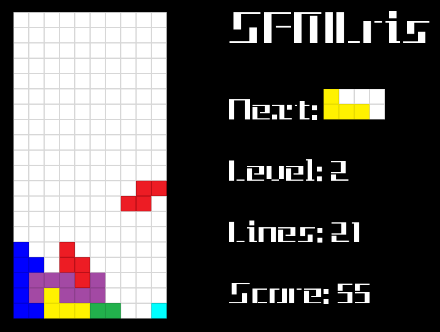

# SFMLris
Simple Tetris clone made using [SFML](https://www.sfml-dev.org/), therefore: **SFMLris** ;)

Keys:
* **P** -  pause/unpause game
* **M** - toggle music on/off
* **left/right** arrows - move block left/right
* **down** arrow - drop block down
* **up** arrow - rotate block clockwise

### About
Some time ago I've read nice article ([found here](https://www.gamedev.net/tutorials/programming/general-and-gameplay-programming/how-do-i-make-games-a-path-to-game-development-r892/)) stating that, each aspiring game developer should start from creating Tetris like game. 
Reasons for it are as follow:
* game is *simple* so it can be created in relatively quickly (it took me couple of months in so called free time though…)
* it requires usage of [game loop](https://gameprogrammingpatterns.com/game-loop.html) - mechanisms that is used in all more sophisticated products
* and lastly but not least: it’s just fun to do so ;)

I’ve created similar clone some time ago in the past but:
* I thought that I’ve lost the source code
* I’ve found it... and was really regretting that it wasn't lost in the first place ;) (as it was created when I was still pretty green)

Looking at it I’ve wondered if my programming skills improved since that time.
Therefore, I’ve created new version from scratch.
 
### Tetris guideline
Main mechanic was more or less based on this [guideline](https://tetris.fandom.com/wiki/Tetris_Guideline)

### Media and arthworks
Sadly I’m not music composer or art creator, so almost all of media used in this game are from external sites:
* main music theme: [twister-tetris created by 'Poinl'](https://opengameart.org/content/twister-tetris)
* level up sound [created by 'Bart'](https://opengameart.org/content/level-up-sound-effects)
* all other sounds [created by 'SubspaceAudio'](https://opengameart.org/content/512-sound-effects-8-bit-style)
* game font [found on 'dafont'](https://www.dafont.com/tetris.font)

Tetrominos texture I've created myself (and I'm proud of it ;) )

### License
This project is licensed under the [MIT License](https://opensource.org/licenses/MIT) - see the LICENSE file for details